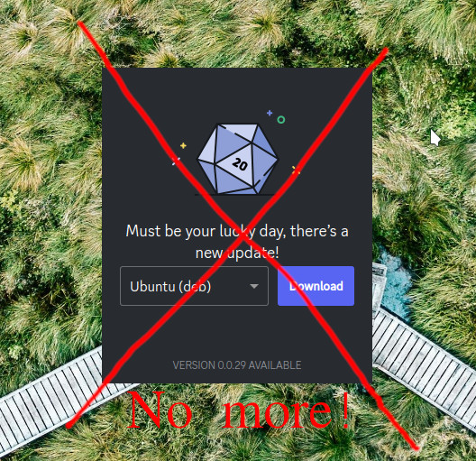

<div style="text-align:center">

# __Discord Terminal Updater__

</div>

Simple bash script for updating Discord app on Linux!

<div style="text-align:center">




***No more!***

</div>

# 1. Description

This simple bash script is used to check, download and update Discord app automatically!

Normally, as shown on the photo, if there is an Discord update it is required to open browser, download package and install it. All of it is done automatically! 

The script checks installed version and most current version of app. By comparing them, it decides if it is required to update or not. If so, it will download the newest `.deb` package from discord official site to the `~/Downloads/` folder and install it. 

The script can be placed as a part of other updater script, or it can be placed as a startup script.

Works on Kubuntu 22.04.

# 2. Remarks

If update is available, `sudo` permissions will be required to install it. They will have to provided by user.

The following Warning may appear. The script will succeed nevertheless. According to the Internet, this Warning can be ignored. 


```
N: Download is performed unsandboxed as root as file '/home/user/Downloads/discord_update.deb' couldn't be accessed by user '_apt'. - pkgAcquire::Run (13: Permission denied)
Removing update packege: /home/user/Downloads/discord_update.deb
```
<br>
<br> 
Have fun!
